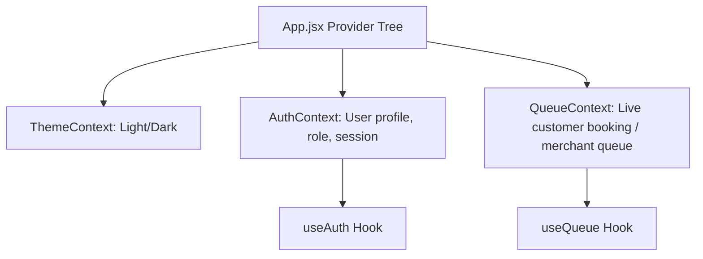

# AntiGravity (QueueLess) Web Application Migration Plan

This implementation plan provides a comprehensive technical blueprint for migrating the AntiGravity (QueueLess) Android application to a responsive, premium Web Application.

---

## 1. Complete Folder Structure

Below is the planned directory layout for the React + Vite frontend application:

```
src/
├── assets/             # SVGs, images, static assets (React logos, default avatars, banners)
├── components/         # Shared, reusable UI components
│   ├── ui/             # Atomic components: Button, Input, Card, Modal, Spinner, etc.
│   ├── glass/          # Glassmorphic containers and styling widgets (GlassContainer equivalent)
│   ├── layout/         # Navigation: Navbar, Sidebar, Footer, BottomNavigation, ProtectedRoute
│   ├── chatbot/        # AI chatbot (QueueBot) floating window and chat items
│   └── common/         # Maps, rating widgets, date-time selectors, active queue trackers
├── context/            # React Contexts (AuthContext, QueueContext, ThemeContext)
├── firebase/           # Firebase configuration and API services
│   ├── config.js       # Firebase SDK initialization
│   ├── auth.js         # Authentication functions (Email, Phone, Google)
│   ├── db.js           # Firestore queries & transaction services (bookings, businesses, reviews, etc.)
│   ├── storage.js      # Firebase Cloud Storage uploads (avatars, logos, cover photos)
│   └── messaging.js    # FCM client configuration
├── hooks/              # Custom React hooks (useAuth, useFirestoreQuery, useGeolocation, useOllama)
├── pages/              # Page views matching routes
│   ├── auth/           # Login, RegisterCustomer, RegisterBusiness, PhoneLogin, OtpVerification, ResetPassword
│   ├── customer/       # Home, SearchResult, MapView, BusinessProfile, ServiceSelection, DateTimePicker, BookingConfirmation, ActiveQueue, Appointments, CustomerProfile
│   ├── business/       # BusinessDashboard, LiveQueueManager, ManageStaff, ManageServices, BusinessSettings, Analytics
│   ├── admin/          # AdminDashboard, ReportsExport
│   └── shared/         # Splash, Onboarding, RoleSelection, HelpFAQ
├── styles/             # Global CSS style rules and design system variables
│   ├── index.css       # Core design system tokens (colors, animations, fonts)
│   └── theme.css       # Glassmorphism utilities, scrollbars, helper utility classes
├── utils/              # Helper utilities (date formatters, export helpers, ML wait time formulas)
├── App.jsx             # Main routing engine & provider setup
└── main.jsx            # React app mount point
```

---

## 2. Route Map

The application routes are structured to handle role-based redirection, public access, customer flows, merchant tools, and super-admin portals:

| Route Path | View | Allowed Roles | Access Rules / Purpose |
| :--- | :--- | :--- | :--- |
| `/` | `Splash` | All | App bootstrap, auto-login session check, roles redirect. |
| `/onboarding` | `Onboarding` | Guest | Intro sliders, tutorial; writes check to `localStorage`. |
| `/role-selection` | `RoleSelection` | Guest | Selects pipeline (`customer` vs `business`). |
| `/login` | `Login` | Guest | Email, Google, Phone auth entries. |
| `/phone-login` | `PhoneLogin` | Guest | SMS triggering form with reCAPTCHA. |
| `/otp` | `OtpVerification` | Guest | Code verification validator. |
| `/register/customer`| `RegisterCustomer` | Guest | Basic customer signup fields. |
| `/register/business`| `RegisterBusiness` | Guest | Merchant details and owner setup. |
| `/forgot-password` | `ResetPassword` | Guest | Password reset email trigger. |
| `/home` | `CustomerHome` | Customer | Dashboard containing category tabs, nearby shops, and stats. |
| `/search` | `SearchResult` | Customer | Text query filter results grid. |
| `/map` | `MapView` | Customer | Map container showing local shops with detail sheet drawers. |
| `/business/:id` | `BusinessProfile` | Customer | Hero panel, hours, staff grid, review log, and CTAs. |
| `/business/:id/services` | `ServiceSelection` | Customer | Services checkbox list and staff assignment drawer. |
| `/business/:id/datetime` | `DateTimePicker` | Customer | Timeslot selector and wait prediction charts. |
| `/business/:id/confirm` | `BookingConfirmation`| Customer | Wallet vs Razorpay checkout page. |
| `/queue` | `ActiveQueue` | Customer | Active wait progress widget and realtime position tracker. |
| `/appointments` | `Appointments` | Customer | Live and historical appointments list. |
| `/profile` | `CustomerProfile` | Customer | Account updates, avatars, and wallet transaction history. |
| `/dashboard` | `BusinessDashboard` | Business | Main business stats grid and active queue length monitors. |
| `/queue-manager` | `LiveQueueManager` | Business | Active queue list, "Serve Next", "Skip", "Remove" controls. |
| `/staff` | `ManageStaff` | Business | CRUD panel for managing service staff members. |
| `/services` | `ManageServices` | Business | CRUD panel for configuring services catalogue. |
| `/settings` | `BusinessSettings` | Business | Business cover image uploads, hours, descriptions. |
| `/admin` | `AdminDashboard` | Admin | Super-admin analytics overview & listings control table. |
| `/admin/reports` | `ReportsExport` | Admin | Export utility for system metrics and transaction logs. |
| `/help` | `HelpFAQ` | All | Support tickets and static FAQ logs. |

---

## 3. Component Map

To keep the codebase maintainable, UI components are segmented by scope:

### `components/ui/` (Atomic UI Library)
- **`Button.jsx`**: Sleek gradients, glassmorphism border glows, standard loading spinner overlays.
- **`Input.jsx`**: Floating label text fields with focus glow transitions and custom error labels.
- **`Card.jsx`**: Standard container card with configurable shadows and borders.
- **`Modal.jsx`**: Frameless backdrop blur popup window using CSS fade/scale animations.
- **`Spinner.jsx`**: Theme-matching ring loader.

### `components/glass/` (Glassmorphic Container System)
- **`GlassContainer.jsx`**: Flexible component reproducing Flutter's `GlassContainer` with custom backgrounds, opacity, blur radius, borders, and border-radius.

### `components/layout/` (Shell and Navigation)
- **`Navbar.jsx`**: Responsive header featuring brand logotype, profile dropdowns, and notifications alert bells.
- **`Sidebar.jsx`**: Navigation menu drawer for merchants and desktop layouts.
- **`BottomNavigation.jsx`**: Sleek iOS/Android style bottom navigation with floating center action indicator for mobile dimensions (< 768px).
- **`ProtectedRoute.jsx`**: Security wrapper verifying authentication state and checking matching role keys.

### `components/chatbot/` (QueueBot Floating Agent)
- **`QueueBot.jsx`**: Persistent floating action button (FAB) that opens a sidebar chat assistant. Handles text inputs, text-to-speech toggles, and connects to local Ollama or Gemini fallbacks.
- **`ChatMessage.jsx`**: Dynamic user and bot message bubbles with typing animations.

### `components/common/` (Shared Features)
- **`GoogleMapViewer.jsx`**: Configures google maps canvas, rendering marker points dynamically with color coding based on store availability.
- **`ReviewStars.jsx`**: Numeric representation showing full, half, and empty stars with click action events.
- **`DateTimePickerWidget.jsx`**: Selectable calendar date grid and active hourly slots showing ML-suggested booking intervals.
- **`WaitPredictorChart.jsx`**: SVG interactive graphs showing estimated queue wait time projections.

---

## 4. Page Map

Each page manages the assembly of atomic and common components for its viewport:

- **`pages/shared/`**:
  - `Splash.jsx`: Full-viewport background gradient, handles auth state verification.
  - `Onboarding.jsx`: Swipable walkthrough slides with "Skip" / "Get Started" triggers.
  - `RoleSelection.jsx`: Responsive layout presenting clear Customer vs Business merchant choice.
- **`pages/auth/`**:
  - `Login.jsx` / `RegisterCustomer.jsx`: Form layouts implementing floating input fields, third-party buttons, and error panels.
  - `PhoneLogin.jsx` / `OtpVerification.jsx`: Phone number collector, captcha verification triggers, and OTP digit boxes.
  - `ResetPassword.jsx`: Email field submission panel.
- **`pages/customer/`**:
  - `CustomerHome.jsx`: Category navigation strip, category listings, promotional sliders, search trigger.
  - `SearchResult.jsx`: Multi-column result grids with sorting sidebar.
  - `MapView.jsx`: Fullscreen map canvas with slide-up venue preview sheets.
  - `BusinessProfile.jsx`: Dynamic cover header, collapsible accordions for services/staff, reviews matrix, and CTAs.
  - `ServiceSelection.jsx` / `DateTimePicker.jsx` / `BookingConfirmation.jsx`: Step-by-step booking configuration screens.
  - `ActiveQueue.jsx`: Realtime tracking interface showing circular progress bar, live queue updates, and cancel action buttons.
  - `Appointments.jsx`: Tabs filter showing active vs past reservations.
- **`pages/business/`**:
  - `BusinessDashboard.jsx`: Merchant metrics grid, quick action widgets, and active queue summaries.
  - `LiveQueueManager.jsx`: Main live queue workspace showing current server slot status, queue items list, and transaction operation controls.
  - `ManageStaff.jsx` / `ManageServices.jsx` / `BusinessSettings.jsx`: CRUD configurations tables and upload components.

---

## 5. Firebase Integration Map

Direct correspondence of Firestore endpoints, data schemes, and operation types:

### Authentication Layer (`src/firebase/auth.js`)
- **Email Signin / Signup**: uses standard `signInWithEmailAndPassword` and `createUserWithEmailAndPassword`.
- **Google OAuth**: triggers popups via `signInWithPopup` with `GoogleAuthProvider`.
- **SMS Phone Authentication**:
  - Instantiates `RecaptchaVerifier` referencing a hidden DOM container.
  - Executes `signInWithPhoneNumber`.
  - Captures verification code inputs for confirmation logic.

### Firestore Access Layer (`src/firebase/db.js`)
- **Real-Time Subscriptions**:
  - `onSnapshot(doc(db, "queues", businessId))` -> Updates Live Queue progress bars.
  - `onSnapshot(query(collection(db, "bookings"), where("customerId", "==", uid)))` -> Populates Appointments.
  - `onSnapshot(query(collection(db, "notifications"), where("userId", "==", uid), orderBy("createdAt", "desc")))` -> Pulls instant notification arrays.
- **Atomic Operations (Transactions)**:
  - `serveNextTransaction(businessId)`: Retrieves `/queues/{businessId}`, pops index 0, transitions its `/bookings/{bookingId}` document status to `'active'` (or next to `'confirmed'`), shifts wait times, and commits changes atomically.
  - `skipCustomerTransaction(businessId, bookingId)`: Reorders positions in `/queues/{businessId}` items array and commits atomically.
  - `processWalletPayment(userId, bookingId, price)`: Deducts amount from `/users/{userId}.walletBalance`, checks balances, sets `/bookings/{bookingId}.paymentStatus` to `'paid'`, and adds transaction ledger records under `/transactions` inside a transaction.

### Storage Service (`src/firebase/storage.js`)
- Uses `uploadBytesResumable` and `getDownloadURL` targeting paths `/users/{userId}/avatar.jpg` and `/businesses/{businessId}/{logo|cover}.jpg`.

### Cloud Messaging (`src/firebase/messaging.js`)
- Instantiates service workers and collects FCM device registration tokens for browser-specific background deliveries.

---

## 6. State Management Plan

State management is handled via **React Context API** coupled with custom hooks for local component subscriptions. This avoids heavy external state containers like Redux while retaining reactive real-time updates.



### Context Contexts Details:
1. **`AuthContext`**:
   - Manages: `currentUser` (Auth state object), `userProfile` (Firestore user details including role and balance), and `loading` boolean.
   - Triggers: Auth state changes listener (`onAuthStateChanged`). On auth change, it fetches the corresponding `/users/{uid}` profile, establishing user role cache.
2. **`ThemeContext`**:
   - Manages: `'light'` vs `'dark'` mode class names on `document.documentElement` to control gradients and glass properties.
3. **`QueueContext`**:
   - Manages: State of the currently active booking for a customer, or active incoming queue updates for merchants. Unsubscribes from listeners automatically on page departures.

---

## 7. Feature Build Order

The migration will be carried out in 8 distinct phases, prioritizing base layers, routing, and database integrations before building core features.

```mermaid
gantt
    title AntiGravity Web App Build Order
    dateFormat  YYYY-MM-DD
    section Core Infrastructure
    Phase 1: Project Setup & Variables  :active, p1, 2026-06-11, 2d
    Phase 2: Auth System & Verification : p2, after p1, 3d
    section Customer Features
    Phase 3: Category Discovery & Maps  : p3, after p2, 3d
    Phase 4: Booking & Live Queue View  : p4, after p3, 4d
    section Merchant Portal
    Phase 5: Queue Control & CRUD Panels: p5, after p4, 4d
    section Advanced Integrations
    Phase 6: QueueBot & Audio Engine    : p6, after p5, 3d
    Phase 7: Super Admin & PDF Exporter : p7, after p6, 2d
    section QA & Deployment
    Phase 8: Optimization & Sync Check  : p8, after p7, 2d
```

### Phase Details

#### Phase 1: Project Setup & Firebase Core
- Install NPM dependencies (`firebase`, `react-router-dom`, `lucide-react`).
- Create file directories.
- Configure `src/firebase/config.js` and initialize services.
- Define global design system properties inside `src/styles/index.css` (primary purple, coral, teal, amber, gradients).
- Configure layouts (Responsive Sidebar, Navbar, and Bottom Nav for mobile).

#### Phase 2: Authentication Views
- Build Login, Registration forms, and Reset Password views.
- Build Google OAuth login using popup mechanisms.
- Build Phone authentication form + invisible reCAPTCHA verifier workflow.
- Write router route guard middleware verification logic based on user roles (`customer`, `business`, `admin`).

#### Phase 3: Customer Discovery Portal
- Build Customer Home (Nearby locations, category grids, metrics panel).
- Configure search query page displaying filter grids.
- Implement Google Maps container. Add geolocation tracking, markers drawing, and business details slide-up panels.

#### Phase 4: Booking & Checkout Flow
- Build Service Selection checkbox accordions & staff picker.
- Build DateTimePicker timeslots calendar grids and wait projection charts.
- Build Booking Confirmation panel showing transaction previews.
- Integrate Razorpay Checkout JS modal SDK standard workflow.
- Build Wallet payment checkout logic inside Firestore transactions.
- Build Active Queue status screen mapping real-time queue snapshot updates.

#### Phase 5: Merchant Dashboard Portal
- Build Business Dashboard metrics layout.
- Build Live Queue Manager console incorporating serving queues tables.
- Implement transactional `serveNext` and `skipCustomer` functions.
- Create CRUD panels for services catalogs, active staff members list, and calendar schedules.
- Design Merchant settings configuration forms.

#### Phase 6: AI Chat & Voice Assistant
- Build Floating QueueBot chatbot drawer components.
- Connect interface to client-side LLM configurations (Gemini and local Ollama port `11434` fallback).
- Build Speech-to-Text inputs matching voice command intents.

#### Phase 7: Super Admin Panel
- Create Super-admin controls panel.
- Implement client-side CSV / PDF report exporter scripts using standard DOM export methods.

#### Phase 8: Optimization & Verification
- Verify memory leak closures (unmounting snapshot listener cancellations).
- Verify database index configuration settings.
- Conduct cross-platform Android-Web sync validation tests.

---

## 8. Design Decisions Reached

We have finalized the following design decisions based on production stability, security, and developer velocity best practices:

> [!TIP]
> 1. **Gemini API Key Handling**:
>    - **Decision**: Store keys in client-side Vite environment variables (`import.meta.env.VITE_GEMINI_API_KEY`) for rapid frontend implementation, but isolate all AI calling logic inside `src/firebase/chatbot.js` or `src/hooks/useOllama.js`. This guarantees that if you transition to a serverless backend/proxy function later to fully hide the API key, you will only need to modify one single file.
> 
> 2. **Razorpay Key Configurations**:
>    - **Decision**: Load configurations dynamically from the global Firestore collection `/config/payments` with a local environment variable fallback (`import.meta.env.VITE_RAZORPAY_KEY_ID`). Loading dynamically allows you to swap from test mode to live mode, or update keys instantly, without having to rebuild or redeploy the entire frontend code.
> 
> 3. **Wait Predictor Endpoint**:
>    - **Decision**: Build a robust client-side mathematical wait time calculation (summing average service durations of preceding customers in the queue, factored by active staff) as the core engine. This ensures the app is self-sufficient and works flawlessly out-of-the-box, with a clean configuration switch to connect to the external REST API if configured.
> 
> 4. **Staff Management Constraints**:
>    - **Decision**: Keep staff membership strictly isolated to their specific business (under `/businesses/{businessId}/staff`). The DateTime Picker slot selector will query active `/bookings` matching that specific staff member, business, and date, dynamically disabling any timeslots that would cause scheduling collisions.


---

## 9. Verification Plan

### Automated Checks
- Run compilation builds: `npm run build`.
- Run linter verifications: `npm run lint`.

### Manual Testing
- Validate responsive styling by resizing screens through mobile viewports (simulating Bottom Navigation) to full desktop monitors.
- Perform simultaneous test actions: Cancel booking on Android, check if the status update reflects immediately on the Web client without page refresh.
- Run local Ollama serve integrations, updating CORS parameters, and test chatbot query responses.
