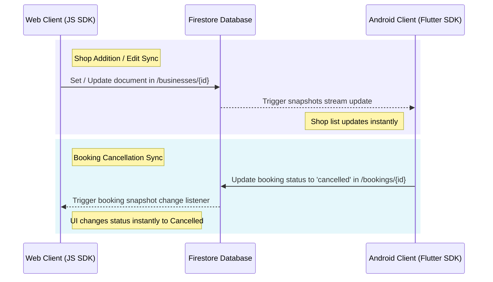
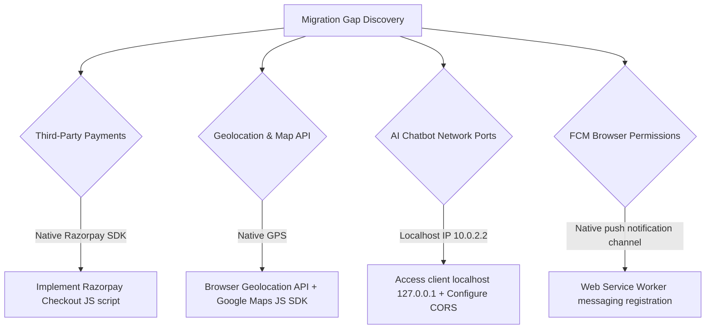

# AntiGravity (QueueLess) Web Application Migration Analysis Report

This report provides a 1:1 migration analysis and system blueprint for translating the **AntiGravity (QueueLess)** Android application into a fully synchronized Web Application. It outlines the current Flutter-based Android architecture and maps out a detailed plan to replicate all features, database schemas, visual aesthetics, and synchronization rules in a web environment.

---

## 1. Executive Summary & Overview
The **AntiGravity (QueueLess)** system is a modern, real-time, AI-powered queue and booking management application designed to eliminate physical waiting lines in clinics, salons, spas, banks, and government offices.
The Android client is built using Flutter (incorporating BouncingScrollPhysics, custom sliver-based scroll containers, glassmorphism UI widgets, and local LLM/Gemini integrations). The database layer is hosted on Firebase (Firestore, Firebase Auth, Firebase Storage, and Firebase Cloud Messaging).
To deliver a 1:1 replicated Web Application that syncs in real-time with the Android application, the web application must share the same Firestore instance and security rules, resolving platform-specific limitations (such as phone authentication, local network routing for Ollama, and native SDK payment gateways).

---

## 2. Database Architecture Audit

The database is built on Google Cloud Firestore, a document-oriented NoSQL database. Below is the audited collection scheme with exact field keys, data types, purpose, and relationship constraints.

### Collections & Schema Matrix

| Collection Name | Document ID Type | Purpose | Field Name | Data Type | Relationships / Constraints |
| :--- | :--- | :--- | :--- | :--- | :--- |
| **`users`** | Firebase Auth UID | Stores user profiles, roles, and wallet balances. | `id` <br> `name` <br> `email` <br> `phone` <br> `role` <br> `profileImage` <br> `walletBalance` <br> `createdAt` | String <br> String <br> String <br> String <br> String <br> String? <br> Double <br> Timestamp | `role` must be `'customer'`, `'business'`, or `'admin'`. <br> Linked to `bookings` (`customerId`). |
| **`businesses`** | Unique Business ID | Holds business profiles, geolocations, and service categories. | `id` <br> `name` <br> `category` <br> `description` <br> `address` <br> `lat` <br> `lng` <br> `phone` <br> `rating` <br> `reviewCount` <br> `isVerified` <br> `plan` <br> `coverImage` <br> `logoImage` <br> `hours` <br> `ownerId` <br> `currentQueue` <br> `isOpen` | String <br> String <br> String <br> String <br> String <br> Double <br> Double <br> String <br> Double <br> Int <br> Boolean <br> String <br> String? <br> String? <br> Map<String, dynamic>? <br> String <br> Int <br> Boolean | `ownerId` maps to a `users.id` with role `'business'`. <br> `plan` must be `'free'`, `'pro'`, or `'enterprise'`. <br> Contains `services` and `staff` subcollections. |
| **`bookings`** | Auto-generated ID | Logs customer appointments, booking statuses, and queue positions. | `id` <br> `customerId` <br> `customerName` <br> `businessId` <br> `businessName` <br> `serviceId` <br> `serviceName` <br> `staffId` <br> `dateTime` <br> `status` <br> `queuePosition` <br> `estimatedWaitMinutes` <br> `price` <br> `paymentStatus` <br> `tokenNumber` <br> `createdAt` <br> `updatedAt` | String <br> String <br> String <br> String <br> String <br> String <br> String <br> String? <br> Timestamp <br> String <br> Int <br> Int <br> Double <br> String <br> String <br> Timestamp <br> Timestamp? | `customerId` references `users.id`. <br> `businessId` references `businesses.id`. <br> `status` values: `'pending'`, `'confirmed'`, `'active'`, `'served'`, `'cancelled'`. <br> `paymentStatus` values: `'pending'`, `'paid'`, `'refunded'`. |
| **`queues`** | Business ID (`businessId`) | Manages the live active queue order and serving state for a business. | `businessId` <br> `currentServingToken` <br> `currentServingName` <br> `currentServingService` <br> `totalWaiting` <br> `avgWaitMinutes` <br> `items` <br> `lastUpdated` | String <br> String <br> String <br> String <br> Int <br> Int <br> Array<Map> <br> Timestamp | `items` is an array of QueueItems. Each map has: <br> - `bookingId` (String) <br> - `customerName` (String) <br> - `serviceName` (String) <br> - `position` (Int) <br> - `status` (String) <br> - `waitMinutes` (Int) |
| **`payments`** | Auto-generated ID | Logs transactional logs processed by external payment gateway. | `paymentId` <br> `orderId` <br> `signature` <br> `bookingId` <br> `amount` <br> `userId` <br> `status` <br> `createdAt` | String <br> String <br> String <br> String <br> Double <br> String <br> String <br> Timestamp | `bookingId` references `bookings.id`. <br> `userId` references `users.id`. |
| **`transactions`** | Auto-generated ID | Audits user wallet credits/debits. | `id` <br> `userId` <br> `title` <br> `amount` <br> `type` <br> `paymentId` <br> `status` <br> `createdAt` | String <br> String <br> String <br> Double <br> String <br> String <br> String <br> Timestamp | `userId` references `users.id`. <br> `type` is `'credit'` (positive value) or `'debit'` (negative value). |
| **`reviews`** | Auto-generated ID | Collects ratings and reviews written by customers. | `id` <br> `businessId` <br> `customerId` <br> `customerName` <br> `rating` <br> `text` <br> `reply` <br> `repliedAt` <br> `createdAt` | String <br> String <br> String <br> String <br> Double <br> String <br> String? <br> Timestamp? <br> Timestamp | `businessId` references `businesses.id`. <br> `customerId` references `users.id`. |
| **`notifications`** | Auto-generated ID | Stores targeted push/in-app alert records. | `id` <br> `userId` <br> `title` <br> `body` <br> `type` <br> `isRead` <br> `createdAt` | String <br> String <br> String <br> String <br> String <br> Boolean <br> Timestamp | `userId` references `users.id`. |
| **`config`** | Auto-generated ID | Global configuration key-values. | `docId` <br> `settings` | String <br> Map | Read-only for general users; editable by Admins. |

### Subcollections (Under `businesses/{businessId}`)

1. **`services`**
   - **Purpose**: Defines list of services provided by the business.
   - **Fields**:
     - `id`: String (Document ID)
     - `name`: String
     - `description`: String
     - `durationMinutes`: Int
     - `price`: Double
     - `category`: String
     - `isActive`: Boolean
     - `createdAt`: Timestamp
2. **`staff`**
   - **Purpose**: List of staff members working under the business.
   - **Fields**:
     - `id`: String (Document ID)
     - `name`: String
     - `role`: String
     - `isActive`: Boolean
     - `avatar`: String
     - `phone`: String
     - `createdAt`: Timestamp

---

## 3. Data Synchronization Design
Real-time synchronization between the Android (Flutter) application and the Web application is managed via **Firestore Real-time Listeners (`snapshots()`)**. When a state mutation occurs on one client, the server notifies all active listeners on other clients within milliseconds.

### Synchronization Workflows & Triggers



### Key Synchronization Implementation Rules
1. **Live Queue Listeners**:
   Both platforms must establish a snapshot listener on `/queues/{businessId}`.
   - **Web implementation**:
     ```javascript
     import { doc, onSnapshot } from "firebase/firestore";
     onSnapshot(doc(db, "queues", businessId), (snapshot) => {
       if (snapshot.exists()) {
         const queueData = snapshot.data();
         updateQueueUI(queueData);
       }
     });
     ```
2. **Shop Additions/Edits**:
   - Updates made on Android write to `/businesses/{businessId}`. The Web application's home and map views listen to query snapshots on the `businesses` collection and reload their layouts automatically without requiring manual page refreshes.
3. **Queue Serve Actions (Transactional)**:
   - To prevent race conditions where a business owner serves a customer from both a mobile tablet and web dashboard simultaneously, the `serveNext` and `skipCustomer` functions **must** be executed as **Firestore Transactions**.
   - The web app must replicate the Android transactional logic:
     - Read current `items` array from `/queues/{businessId}`.
     - Extract index 0, modify positions/wait times for remaining items.
     - Write updated array and set current serving token info in a single atomic commit.

---

## 4. Complete Feature Matrix

The following matrix maps all features implemented in the Android source of truth and their structural equivalents for the Web application.

| Feature Name | Feature Purpose | Android Screen | Database Dependencies | API Dependencies | Permissions Required | Web Equivalent Needed | Sync Protocol |
| :--- | :--- | :--- | :--- | :--- | :--- | :--- | :--- |
| **Splash Screen** | App bootstrap, auto-login redirect | Splash Screen | None | Firebase Auth state listener | None | Routing middleware redirect | Auth State Change (Live) |
| **Onboarding** | Initial app tutorial/intro | Onboarding Screen | None | None | None | Intro Slider Component | Session Storage |
| **Role Selection** | Selects registration pipeline | Role Selection | None | None | None | Landing Page Portal / Buttons | Internal Route Params |
| **User Sign In** | Email/Password login | Login Screen | `users` | Firebase Auth | None | Web Login Form | Auth State Change (Live) |
| **Google Auth** | Oauth2 login option | Login Screen | `users` | Google Sign In (native SDK) | None | Google Sign-in Popup (JS SDK SDK) | Auth State Change (Live) |
| **Phone Auth** | SMS OTP-based login | Phone Login / OTP | `users` | Firebase Phone Auth (native) | None | Firebase Web Phone Auth + Recaptcha | Auth State Change (Live) |
| **Business Reg** | Registers new merchant | Register Business | `users`, `businesses` | Firestore Write | None | Multi-step Merchant Signup Form | Transactional |
| **Customer Reg** | Registers new client | Register Customer | `users` | Firestore Write | None | Client Signup Form | Transactional |
| **Forgot/Reset Pwd**| Password recovery pipeline | Forgot / Reset Pwd | None | Firebase Auth reset link | None | Web Reset Password Page | Async Email |
| **Home Screen** | Categories, banners, nearby list | Customer Home | `businesses`, `queues` | Location API | Location (Fine/Coarse) | Desktop Dashboard Home | Real-time Query Snapshots |
| **Search & Filter** | Search merchants by query | Search Filter | `businesses` | Firestore Query | None | Filter Search Bar + Grid View | Client-side query |
| **Map View** | Displays merchants on map | Map View | `businesses` | Google Maps API | Location (Fine/Coarse) | Google Maps Web Component | Geolocation API |
| **Venue Details** | Profile, reviews, staff list | Business Profile | `businesses`, `reviews` | Firestore Read | None | Merchant Detail Page | Real-time Listeners |
| **Service Selection**| Choose services and staff | Service Selection | `services`, `staff` | Firestore Read | None | Service List Accordion | Reactive State |
| **Date Time Picker**| Choose appointment timeslot | DateTime Picker | `bookings` | ML Wait Prediction API | None | Calendar/Time Grid Selector | REST Request/Local Fallback |
| **Booking Confirm** | Confirm slot and pay | Booking Confirm | `bookings`, `users` | Razorpay API | None | Checkout Summary Page | Transactional |
| **Active Queue** | Live position, token, wait time | Active Queue | `queues`, `bookings` | None | None | Active Token Overlay / View | Real-time Doc Snapshot |
| **Appointments** | List customer bookings | My Appointments | `bookings` | None | None | Bookings Dashboard Grid | Real-time Query Snapshot |
| **Booking Details** | Token QR, details, cancel btn | Appointment Detail | `bookings`, `queues` | None | None | Appointment Detail Modal | Real-time Listener |
| **Notifications** | Alerts list | Notifications Screen| `notifications`| FCM / Local Notif | Push Permission | Web Push Overlay / Banner | Real-time Query Snapshot |
| **User Profile** | Manage info, upload avatar | Customer Profile | `users` | Firebase Storage | Camera/Gallery | Account Settings Tab | Upload & Update Doc |
| **Reviews & Ratings**| Write merchant feedback | Reviews Ratings | `reviews`, `businesses` | Firestore Write | None | Review Dialog Form | Transactional Cloud Function |
| **Wallet Payment** | Recharge and pay via wallet | Wallet Payment | `transactions`, `users`| Firestore Write | None | Wallet Panel Dashboard | Transactional |
| **Gateway Payment** | Online pay via Razorpay | Razorpay Payment | `payments` | Razorpay SDK | None | Razorpay Web Checkout JS | webhook / Client Callback |
| **Help & FAQ** | Static Q&A guides | Help FAQ Screen | None | None | None | Help Center Page | Static HTML |
| **Super Admin Panel**| Super admin overview statistics| Admin Super Panel | `users`, `businesses` | Admin Analytics API | None | Admin Dashboard | Count aggregation queries |
| **Reports Export** | Generate CSV/PDF reports | Reports Export | `bookings` | Local file generator | Storage write | Web File Downloader | Client-side export generator |
| **Biz Dashboard** | Live queue controls for merchant| Business Dashboard | `queues`, `businesses` | None | None | Merchant Control Center | Real-time Query Snapshot |
| **Live Queue Mgr** | Serve next / skip customers | Live Queue Mgr | `queues`, `bookings` | None | None | Active Queue Control Grid | Transactional |
| **Manage Bookings** | Calendar of merchant bookings | Appointment List | `bookings` | None | None | Booking Calendar Component | Real-time Query Snapshot |
| **Manage Staff** | CRUD staff accounts | Staff Management | `staff` | None | None | Staff Management Panel | Doc mutations |
| **Manage Services** | CRUD service catalog | Service Pricing | `services` | None | None | Service List Manager | Doc mutations |
| **Biz Settings** | Update shop configuration | Business Settings | `businesses` | None | None | Settings Configuration Page | Doc mutations |
| **Notif Settings** | Set SMS/Push frequencies | Notif Settings | `users` | None | None | Notification Toggles Panel | Doc mutations |
| **Subscription Mgr**| Select Starter, Pro, Enterprise| Subscription Plan | `businesses` | Razorpay Sub API | None | Billing & Subscription Portal | Payment Gateway Webhook |
| **Merchant Profile**| Edit business logo, banner | Profile Edit | `businesses` | Firebase Storage | Camera/Gallery | Media uploader components | Storage upload + Update |
| **Review Panel** | Reply to customer reviews | Reviews Manage | `reviews` | None | None | Review Manager Dashboard | Doc update |
| **Wait Predictor** | AI prediction visualizer | Wait Predictor | None | ML Wait Prediction API | None | Wait Time Projection Charts | Local estimation fallback |
| **Smart Slots** | AI slot recommendations | Smart Slots | `bookings` | ML Wait Prediction API | None | Booking Time Recommendations | REST API call |
| **QueueBot Chat** | Interactive booking/status bot | AI Queue Bot | None | Gemini API / Ollama | Microphone | Floating Web Chat Assistant | REST API / Local fallback |
| **Voice Booking** | Voice command queue Booker | Voice Booking | `bookings` | SpeechToText API | Microphone | Web Speech Recognition | Web Audio API |

---

## 5. Screen-by-Screen Functional Blueprint
Every user viewport must map 1:1 to the verified logical flow of the Android screens.

### 5.1 Authentication Screens
* **Splash Screen (`/`)**:
  - **Inputs**: Checking Cache (Shared Preferences / Local Storage) for active auth session.
  - **Outputs**: Redirecting to `/home` (if logged in as customer), `/dashboard` (if business), `/admin` (if admin), or `/onboarding` (first-time boot).
* **Onboarding (`/onboarding`)**:
  - **Buttons**: "Skip", "Next", "Get Started".
  - **Outputs**: Stores a LocalStorage flag `has_seen_onboarding = true`, redirects to `/role-selection`.
* **Role Selection (`/role-selection`)**:
  - **Inputs**: User click selection on 'Customer' or 'Business' role card options.
  - **Validation**: Role selection state must not be empty to enable the "Continue" action.
  - **Navigation**: "Continue" -> `/register/customer` or `/register/business`. "Already have an account?" -> `/login`.
* **Login (`/login`)**:
  - **Inputs**: Email, Password fields.
  - **Validation**: Email pattern matching `^[^@]+@[^@]+\.[^@]+$`; Password length >= 6.
  - **Buttons**: "Sign In", "Sign In with Google", "Login with Phone", "Forgot Password".
* **Phone Login (`/phone-login`)**:
  - **Inputs**: 10-digit mobile number starting with Indian country code (+91).
  - **Buttons**: "Send OTP".
  - **Outputs**: Triggers verification ID generation, routes to `/otp` passing `verificationId` and `phone` via route state metadata.
* **OTP Verification (`/otp`)**:
  - **Inputs**: 6-digit numeric verification code.
  - **Validation**: Autocomplete verification code field size of exactly 6 characters.
  - **Buttons**: "Verify & Login", "Resend OTP".
* **Register Customer (`/register/customer`)**:
  - **Inputs**: Full Name, Email, Password, Phone Number.
  - **Outputs**: Creates Auth credentials, sets role as `'customer'` in `/users/{uid}`, routes to `/home`.

### 5.2 Customer Screens
* **Home Screen (`/home`)**:
  - **Inputs**: Search query, Category filter selection, Geolocation coordinates.
  - **Outputs**: Responsive Grid of businesses, Hero Banners Carousel, Quick Statistics Cards (Active Queues, Avg Wait Time, Location Count).
  - **Real-Time Data**: Subscribes to nearby businesses dynamically filtered by the selected category.
* **Search & Filter (`/search`)**:
  - **Inputs**: Search term input, sort selectors (Rating, Distance, Queue size).
  - **Outputs**: Result listings. Replicates Android matching: queries match name, category, and address.
* **Map View (`/map`)**:
  - **Inputs**: Map drag/zoom coordinates, Search query.
  - **Outputs**: Interactive markers. Markers are color-coded (Azure = User Location, Yellow = Selected, Green = Open venue, Red = Closed venue). Clicking a marker triggers the slide-up *Selected Business Bottom Sheet* with metadata and a "Book Now" CTA.
* **Business Profile (`/business/:id`)**:
  - **Inputs**: Business ID path parameter.
  - **Outputs**: Hero banner cover image, Business details, Staff scroll list, Services catalog, Average Rating score and customer review listing.
* **Service Selection (`/service-selection`)**:
  - **Inputs**: Service selection list checkboxes, staff selection dropdown.
  - **Outputs**: Combined pricing total, routes to `/datetime-picker`.
* **DateTime Picker (`/datetime-picker`)**:
  - **Inputs**: Selected Date, timeslot selection.
  - **Validations**: Blocks past time slots. Triggers wait time predictions for the selected slot.
* **Booking Confirmation (`/booking-confirmation`)**:
  - **Inputs**: Summary of booking details, Payment method toggle ('Wallet', 'Pay at Venue', 'Online Payment').
  - **Outputs**: Confirms transaction and calls `createBooking` Firestore write. Redirects to `/queue`.
* **Active Queue (`/queue`)**:
  - **Inputs**: Route state booking metadata.
  - **Outputs**: Circular/linear wait progress indicator bar, estimated wait counter, "Cancel Booking" and "Get Directions" CTAs.
  - **Sync**: Listens in real-time to the active queues subcollection. Automatically increments/decrements position and time on screen.

### 5.3 Business Screens
* **Business Dashboard (`/dashboard`)**:
  - **Outputs**: Live count cards (Active queue length, revenue stats, overall rating), "Serve Next" and "Skip Customer" controls, Real-time queue list table.
* **Live Queue Manager (`/queue-manager`)**:
  - **Inputs**: Merchant click actions on queue queue-item entries.
  - **Buttons**: "Serve Next", "Skip", "Remove".
  - **Transactions**: Atomic increments/decrements via Firestore transactions to guarantee queue status consistency.

---

## 6. Role & Permission Matrix

Access controls are dictated by the logged-in user's role stored inside `/users/{uid}.role` and enforced by Firestore Security Rules.

| User Role | Read Access permissions | Write Access permissions | Route Restrictions | Dashboard Access |
| :--- | :--- | :--- | :--- | :--- |
| **Customer** | `/users/{self}` <br> `/businesses/*` <br> `/bookings/{self}` <br> `/queues/*` <br> `/services/*` <br> `/payments/{self}` <br> `/transactions/{self}` <br> `/notifications/{self}` <br> `/reviews/*` <br> `/config/*` | `/users/{self}` (Update) <br> `/bookings` (Create/Update status to 'cancelled') <br> `/payments` (Create) <br> `/transactions` (Create) <br> `/reviews` (Create/Update/Delete own) | Cannot access `/admin`, `/reports`, `/dashboard`, `/queue-manager`, `/staff`, `/services` edit, `/analytics`. | Customer Dashboard (`/home`, `/profile`, `/appointments`) |
| **Business Owner** | `/users/{self}` <br> `/businesses/{owned}` <br> `/bookings` (where businessId = owned) <br> `/queues/{owned}` <br> `/services/*` <br> `/staff/{owned}` <br> `/reviews/*` <br> `/analytics/{owned}` | `/businesses/{owned}` (Update) <br> `/bookings` (Update statuses) <br> `/queues/{owned}` (Update/Delete) <br> `/services` (Create/Update/Delete) <br> `/staff` (Create/Update/Delete) <br> `/reviews` (Update reply fields) | Cannot access `/admin` super panel, `/reports` (Super admin platform reports). | Merchant Portal (`/dashboard`, `/queue-manager`, `/staff`, `/services`, `/analytics`) |
| **Super Admin** | *All collections (Wildcard read allowed)* | *All collections (Wildcard write allowed)* | No route restrictions. | Super Admin Command Dashboard (`/admin`, `/reports`) |
| **Employee (Staff)** | Access configured via subcollections under owned business (read-only for assigned queues). | Cannot update settings, configure pricing, or view billing. | Restricted to viewing current queue checklist views. | Limited view of `/queue-manager`. |

---

## 7. Authentication & Security Gap Analysis
Migrating authentication from native Android SDK libraries to Web browser equivalents requires several adjustments to maintain standard security levels:

1. **OAuth Redirects / Popups**:
   - Android utilizes Google Sign-In with client IDs tied to SHA-1 signature hashes.
   - Web requires standard Google Sign-In popups or redirect workflows configured inside the Firebase console. The web-specific OAuth client ID must be configured in `DefaultFirebaseOptions.web` (currently set to `378813036718-prm8mca23ojju9puvl3l4iq0c78mp7oo.apps.googleusercontent.com` inside the code).
2. **Phone Authentication**:
   - Android intercepts SMS messages natively (automatic verification retrieval).
   - Web **requires** the inclusion of a reCAPTCHA element (visible or invisible) to prevent API spamming before Firebase can issue SMS codes.
   - **Replication Action Plan**: Integrate a hidden container for `recaptcha-verifier` when creating the OTP challenge request:
     ```javascript
     import { RecaptchaVerifier, signInWithPhoneNumber } from "firebase/auth";
     const recaptchaVerifier = new RecaptchaVerifier(auth, 'recaptcha-container', {
       'size': 'invisible'
     });
     ```
3. **Session Management Security**:
   - Web applications are vulnerable to Cross-Site Scripting (XSS). LocalStorage or IndexedDB is used by Firebase JS SDK automatically to persist sessions. Cross-Origin settings must be tightened.
4. **Third-Party Payment Gateways**:
   - **Razorpay**: The Android app depends on `razorpay_flutter` (native Java packages).
   - **Web Equivalency**: Replicate payment calls using the **Razorpay Checkout JS Standard script** (`https://checkout.razorpay.com/v1/checkout.js`).
   - The payment success payload must trigger identical client-side callback logic, writing successful transactions to Firestore (calling the equivalent of `savePayment` and updating booking statuses).

---

## 8. Backend & Firebase Architecture Analysis

To ensure complete cross-platform synchronicity, the Web application must operate on the exact same Firebase Project instance (`queueless-d131e`).

### Firestore Security Rules Assessment
The security rules (`firestore.rules`) have been reviewed. They are production-ready and securely validate access based on request authorization tokens. The Web app must respect these constraints:
- **`users` rule**: Reads and Updates are restricted to `isOwner(userId) || isAdmin()`. The Web client must verify that queries pass the client's current Auth UID to prevent `Insufficient Permissions` exceptions.
- **`bookings` rule**: Reads and Updates are permitted if `resource.data.userId == request.auth.uid` OR the user is the verified `isBusinessOwner(resource.data.businessId)`.
- **`queues` rule**: Write and delete actions require `isBusinessOwner(resource.data.businessId) || isAdmin()`. The customer can only read the queue state.

### Firestore Composite Indexes Required
To avoid query crashes, composite indexes must be defined in `firestore.indexes.json`:
1. **Bookings Query**: `businessId` (Ascending) + `dateTime` (Ascending) (Used in fetching daily schedules).
2. **Notifications Query**: `userId` (Ascending) + `createdAt` (Descending) (Used to order alert lists).
3. **Reviews Query**: `businessId` (Ascending) + `createdAt` (Descending) (Used to order merchant reviews).

---

## 9. File Storage Analysis
- **Image Assets**: User avatars, Merchant cover images, and business logos.
- **Storage Location**: Google Cloud Storage (`queueless-d131e.firebasestorage.app`).
- **Path Rules**:
  - User avatars: `/users/{userId}/avatar.jpg`
  - Merchant logos: `/businesses/{businessId}/logo.jpg`
  - Merchant cover banners: `/businesses/{businessId}/cover.jpg`
- **Permissions**:
  - Reads: Publicly readable for business photos; user avatars restricted to authenticated users.
  - Writes: Restricted to matching owner UID.
- **Web Migration Action Plan**: Replicate file uploads using HTML5 `<input type="file">` file readers, converting files to `Uint8Array` byte blobs before writing to Cloud Storage using `uploadBytes` or `uploadBytesResumable` from the Firebase JS Storage SDK.

---

## 10. Notification Architecture Analysis
Mobile push notifications on Android use FCM (Firebase Cloud Messaging) and native local notifications (`flutter_local_notifications`). Web requires a distinct strategy:

1. **Service Worker Implementation**:
   - Web push notifications **must** use a dedicated service worker file (`firebase-messaging-sw.js`) registered in the root directory to receive messages in the background.
2. **Notification Permission Prompting**:
   - The Web application must request permission from the browser user agent using:
     ```javascript
     Notification.requestPermission().then((permission) => {
       if (permission === 'granted') {
         // Retrieve FCM registration token
       }
     });
     ```
3. **Browser Limitations**:
   - Background push alerts require standard HTTPS (except on localhost).
   - In-app alert overlays (Toast banners) should be styled natively using CSS animations to match Android's local notification look-and-feel when the browser tab is focused.

---

## 11. UI/UX System Audit
The web layout must not feel like a stretched mobile viewport. It must leverage a responsive design system with breakpoints while maintaining the brand's identity.

### Design System Tokens (Mapped from `lib/core/theme`)
- **Primary Color Palette**:
  - `primary`: `#6C63FF` (Deep Purple)
  - `primaryDeep`: `#4E44E7`
  - `coral`: `#FF6584` (Error / Alerts)
  - `teal`: `#00F5D4` (Success / Active Status)
  - `amber`: `#FFBD59` (Warning / Stars)
- **Backgrounds**:
  - Light Theme: Solid white/grey `#F8F7FF`
  - Dark Theme: Gradient transitioning from deep purple/blue to black (`AppGradients.dark`)
- **Card Styles**: Glassmorphic widgets (`GlassContainer`) with border radius `16px` to `24px`, subtle box-shadows, and background transparencies.

### Responsiveness Breakpoints
- **Mobile Viewports (< 768px)**: Bottom Navigation Bar layout structure replicating the Android navigation flow exactly.
- **Tablet Viewports (768px - 1024px)**: Split-screen interface for screens like Map View (Map on left, search list on right) and Business Profile (details on left, booking slots on right).
- **Desktop Viewports (> 1024px)**: Sidebar navigation menus replacing the bottom menu bar, multi-column dashboard tables, card grids, and collapsible navigation headers.

---

## 12. API Matrix
The application relies primarily on Firestore document references, with the exception of two external integration endpoints:

| API Name | Method | Base URL / Service | Request Payload | Response Payload | Auth Required | Purpose | Web Implementation Solution |
| :--- | :--- | :--- | :--- | :--- | :--- | :--- | :--- |
| **Ollama Local LLM** | `POST` | `http://127.0.0.1:11434/api/chat` (Web localhost) | `{"model": "llama3", "messages": [...], "stream": false}` | `{"message": {"content": "Answer String"}}` | No | Chatbot fallback responses when running AI locally. | Accesses web browser local port `11434` directly. Requires configuring CORS settings on the host Ollama client. |
| **ML Wait Time API** | `POST` | `https://your-ml-api.com/predict` | `{"day_of_week": Int, "hour": Int, "queue_length": Int, "service_type": String}` | `{"predicted_minutes": Int, "confidence": Int, "suggestion": String, "best_time": String}` | No | Retrieves accurate wait projections based on peak times. | Standard `fetch()` POST request with JSON payload. Requires HTTPS. |

---

## 13. Performance Analysis
1. **Real-time Listener Management**:
   - Active listeners on collections like `/bookings` or `/queues` consume open sockets.
   - **Web optimization**: Unsubscribe from listeners inside React's `useEffect` cleanup return functions or custom lifecycle methods when components unmount to prevent memory leaks and billing spikes:
     ```javascript
     useEffect(() => {
       const unsubscribe = onSnapshot(docRef, (doc) => { ... });
       return () => unsubscribe(); // crucial cleanup
     }, []);
     ```
2. **Query Caching**:
   - Cache results for static or slow-changing data (like `/config` or static `/services`) to local state store before querying Firestore again.
3. **Pagination & Query Limits**:
   - Geolocation queries for nearby businesses must use limits (`limit(20)`) to minimize memory footprints and document reads.

---

## 14. Migration Risks & Gap Report

Developing a Web application mirroring a Flutter Android application presents several technical challenges and breaking points:



### High Priority Gaps (Must be solved immediately)
* **Razorpay Payment Integration**:
  - *Risk*: Android app references native `razorpay_flutter` event bindings.
  - *Mitigation*: Replace with Razorpay Checkout Javascript SDK. Complete transactional security verification via webhooks on backend functions.
* **Phone Auth OTP Workflow**:
  - *Risk*: Client must solve reCAPTCHA challenges on web browsers before Firebase sends SMS OTPs.
  - *Mitigation*: Add container markup for Recaptcha and call `RecaptchaVerifier` instantiation.

### Medium Priority Gaps
* **Ollama Local Host Resolving**:
  - *Risk*: The Android codebase targets the host computer IP `http://10.0.2.2:11434` for Ollama interactions on the emulator. This IP fails on standard web browsers.
  - *Mitigation*: Update address to `http://127.0.0.1:11434` on Web, and configure client host server to allow cross-origin requests (`OLLAMA_ORIGINS="*" ollama serve`).
* **Geocoding API missing**:
  - *Risk*: The `geocoding` package does not support Web platforms.
  - *Mitigation*: Query address coordinates using the Google Maps Geocoding API or standard OpenStreetMap lookup services via HTTPS.

### Low Priority Gaps
* **Platform UI Physics**:
  - *Risk*: Mobile browsers lack standard `BouncingScrollPhysics` found on Android scroll controllers.
  - *Mitigation*: Use standard smooth-scroll CSS bindings (`scroll-behavior: smooth`).

---

## 15. Web Development Checklist

Use this checklist to track development phases and tasks:

- [ ] **Phase 1: Project Setup & Firebase Core**
  - [ ] Initialize frontend project repository.
  - [ ] Configure `firebase.json` and `DefaultFirebaseOptions.web` connection properties.
  - [ ] Replicate CSS styling palette variables (AppColors, AppGradients, font-family settings).
  - [ ] Implement responsive viewport layout containers (Sidebar vs. Bottom Nav).
- [ ] **Phase 2: Authentication Views**
  - [ ] Build Sign-In / Signup pages.
  - [ ] Implement Google Popup Login.
  - [ ] Build Phone verification container + invisible Recaptcha verifier workflow.
  - [ ] Add routing protection middleware checking user document roles.
- [ ] **Phase 3: Customer Portal**
  - [ ] Build Responsive Home View (stats cards, category selectors, merchant listing).
  - [ ] Implement Google Maps JS viewer + geolocation positioning markers.
  - [ ] Build Service Selection + DateTime slots calendar grids.
  - [ ] Implement Razorpay Checkout JS modal.
  - [ ] Build live Active Queue status viewport + active snapshot listeners.
- [ ] **Phase 4: Merchant Dashboard**
  - [ ] Build Live Queue management panel (Serve Next, Skip buttons).
  - [ ] Replicate Firestore Transactions for atomic queue serving mutations.
  - [ ] Create CRUD panels for services, staff members, and store schedules.
  - [ ] Build analytics review cards.
- [ ] **Phase 5: AI Integrations**
  - [ ] Build Floating QueueBot assistant chat interface.
  - [ ] Integrate local fallback logic matching the Dart intent-detector.
  - [ ] Build HTML5 Web Speech-to-Text integration for voice bookings.
- [ ] **Phase 6: Admin Super Panel**
  - [ ] Build super admin panel views.
  - [ ] Implement CSV and PDF client-side file exporter utilities.
- [ ] **Phase 7: Optimization & Verification**
  - [ ] Implement unsubscribe logic across all component unmount listeners.
  - [ ] Audit Firestore index creation logs.
  - [ ] Verify Cross-platform data mutations sync instantly between Android and Web clients.

---

## 16. Missing Information Checklist
The following points are not fully detailed in the Android source of truth codebase and require merchant/stakeholder clarification:

1. **Production Gemini API Key**:
   - The source of truth uses the placeholder string `'YOUR_GEMINI_API_KEY'`. Confirm if key management will transition to server-side Cloud Functions to prevent api key exposure on client-side JS bundles.
2. **Production Razorpay Key ID**:
   - The codebase has `'YOUR_RAZORPAY_KEY_ID'`. Web testing requires provisioning distinct testing and production webhook URLs.
3. **ML Prediction API Host URL**:
   - The source code refers to `'https://your-ml-api.com/predict'`. Confirm the active backend service host URL for wait-time estimations.
4. **App Config Schema Details**:
   - The config collection rules exist in `firestore.rules` but the exact document configurations are undefined. Define the fields stored in `/config/{docId}`.
5. **Staff Allocation Constraints**:
   - Confirm if staff can serve multiple queues at once, or if bookings must block staff availability across concurrent businesses.
